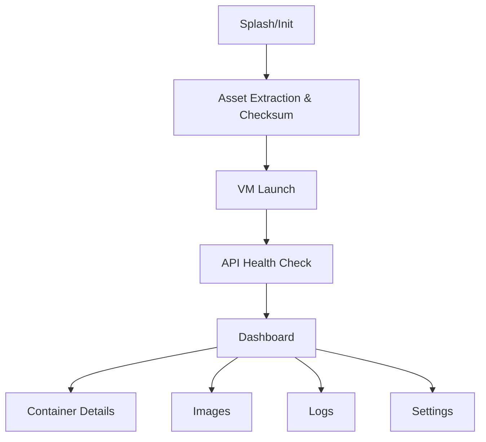

# Single-App, No-Root Architecture — Primary Plan (Android App with Embedded Linux VM)

## 1. Objective

Deliver a single Android app (one APK) that runs Docker/OCI containers on non-rooted devices by embedding and launching a lightweight Linux VM in the background. The app provides all UX and orchestration, with no external dependencies (no Termux) and no root required.

Primary plan: this single-app VM approach is the default and recommended implementation. Detailed implementation and extended guidance are provided in [ARCHITECTURE2.md](ARCHITECTURE2.md).

---

## 2. Why No-Root Requires a VM

- Stock Android kernels on non-rooted devices typically lack:
  - cgroups v1/v2 configuration suitable for Docker
  - full container namespaces/overlayfs access for user apps
  - privileges/capabilities to run a container daemon
- `CONFIG_USER_NS` (user namespace support) is absent from the Android GKI ARM64 `gki_defconfig` (defaults to `n`) and `# CONFIG_PID_NS is not set` is explicitly present; production `non_debuggable.config` enforces these restrictions as security hardening. These configs are VTS-enforced since Android O. [Source: [android.googlesource.com — gki_defconfig](https://android.googlesource.com/kernel/common/+/refs/heads/android-mainline/arch/arm64/configs/gki_defconfig); [kernel/configs README](https://android.googlesource.com/kernel/configs/+/refs/heads/master/README.md)]
- Docker rootless mode requires user namespace support (`CONFIG_USER_NS`), `newuidmap`/`newgidmap` tools, and `/etc/subuid` entries with ≥65,536 subordinate UIDs per user — none of which are available on a stock Android kernel. [Source: [docs.docker.com/engine/security/rootless/](https://docs.docker.com/engine/security/rootless/)]
- Rootless Podman has the same user namespace dependency and cannot bypass this kernel constraint on stock Android.
- A VM (QEMU user-mode/system emulation) provides a complete Linux environment with its own kernel and userspace, enabling Docker/Podman inside the guest without device root.

Validation reference (community-tested approach):
- Running Docker on Android without root via a VM from Termux (QEMU + Alpine) has been demonstrated and is adapted here to a single APK:
  - https://github.com/mabdulmoghni/termux-docker-no-root

---

## 3. High-Level Architecture

```mermaid
flowchart TD
    A[Android OS (non-rooted)]
    B[Single Android App (APK)]
    C[Embedded Linux VM (QEMU)]
    D[API Server inside VM]
    E[Container Runtime inside VM (Docker/Podman)]
    F[Logs/Images inside VM]
    G[User (GUI)]
    H[App Private Storage]

    A --> B
    B --> H
    B --> C
    C --> D
    D --> E
    E --> F
    G --> B
    B --> D
```

Key properties:
- The APK contains QEMU binaries and a compressed Linux base image (QCOW2).
- On first run, the app extracts assets to app-private storage and initializes the VM.
- An API server runs inside the VM; the app communicates via hostfwd (localhost TCP ports).
- Docker/Podman is installed and managed inside the VM; containers and logs live in the VM filesystem.

---

## 4. Components and Responsibilities

### 4.1 Android App (Kotlin/Java or Flutter/React Native with native modules)
- UI/UX: container list, details, images, logs, settings, notifications.
- Orchestration Service: lifecycle of VM, health checks, auto-restart.
- Communication: HTTP client (OkHttp/Retrofit) to VM API via localhost port forwarding.
- Asset Manager: decompress and verify QEMU binaries + base image (QCOW2), bootstrap scripts.
- Security & Settings: token management, retention policies, privacy options.

### 4.2 Embedded Linux VM
- QEMU binary (qemu-system-aarch64 or qemu-system-x86_64 depending on device CPU).
- Base image: Alpine Linux (virt-optimized) QCOW2 for minimal footprint.
- Guest network: slirp (user-mode) with host port forwarding for API access:
  - Example: hostfwd tcp::7080-:7080 (VM API), hostfwd tcp::2222-:22 (optional SSH)
- Bootstrapping: init script or systemd service to start API server and install Docker/Podman on first boot.

### 4.3 VM Internal Services
- API Server (inside VM): FastAPI/Flask/Express/Go exposing:
  - POST /containers/start { image, name, cmd }
  - POST /containers/stop { name }
  - GET /containers
  - POST /images/pull { image }
  - GET /logs?name=...&tail=...
  - POST /exec { name, cmd }
- Container Runtime: Docker or Podman installed via apk/apt.
- Log Storage: /var/log/containers/<name>.log with rotation and compression.

---

## 5. Single-App Implementation Plan (Step-by-Step)

### 5.1 App Packaging (Build-Time)
- Bundle assets into the APK:
  - /assets/qemu/ (qemu-system-*, qemu-img, supporting libs)
  - /assets/images/base.qcow2.gz (compressed base image)
  - /assets/bootstrap/ (guest init scripts, API server files, systemd/init configs)
- Include device-arch builds:
  - Prefer aarch64; add x86_64 fallback for emulators/Intel devices.
- Code-sign and configure Play Store delivery.

### 5.2 First-Run Initialization (Runtime)
- Extract assets to app-private storage:
  - /data/data/<app>/files/qemu/
  - /data/data/<app>/files/vm/base.qcow2
  - /data/data/<app>/files/vm/user.qcow2 (created by qemu-img for user data)
- Verify checksums (SHA-256) to ensure asset integrity.
- Create user image:
  - qemu-img create -f qcow2 user.qcow2 8G
- Use base as backing file for user image to keep size minimal.

### 5.3 VM Launch and Networking
- QEMU launch command (example for aarch64 with Alpine):
```
qemu-system-aarch64 \
  -machine virt \
  -cpu cortex-a53 \
  -smp 2 \
  -m 2048 \
  -drive if=none,file=/data/data/<app>/files/vm/base.qcow2,id=base,format=qcow2,readonly=on \
  -drive if=none,file=/data/data/<app>/files/vm/user.qcow2,id=user,format=qcow2 \
  -device virtio-blk-pci,drive=user \
  -netdev user,id=net0,hostfwd=tcp::7080-:7080,hostfwd=tcp::2222-:22 \
  -device virtio-net-pci,netdev=net0 \
  -display none \
  -daemonize
```
Notes:
- Use -daemonize to background the VM; track PID for lifecycle management.
- slirp user-mode networking avoids root; hostfwd exposes VM services on localhost.

Slirp user-mode networking constraints (authoritative):
- **Performance:** "a lot of overhead so the performance is poor" compared to tap/bridge networking. [Source: [wiki.qemu.org/Documentation/Networking](https://wiki.qemu.org/Documentation/Networking)]
- **ICMP/ping:** "ICMP traffic does not work (so you cannot use ping within a guest)." [Source: [wiki.qemu.org/Documentation/Networking](https://wiki.qemu.org/Documentation/Networking)]
- **Guest accessibility:** "the guest is not directly accessible from the host or the external network" — only explicitly hostfwd'd ports are reachable inbound. [Source: [wiki.qemu.org/Documentation/Networking](https://wiki.qemu.org/Documentation/Networking)]
- TCP and UDP port forwarding via hostfwd is fully supported; advanced NAT features available with tap are not.

### 5.4 Guest Bootstrap (First Boot)
- A systemd/init script inside the guest performs:
  - Package update (apk update) and install Docker/Podman.
  - Enable Docker service (rc-update add docker default) or Podman socket.
  - Start API server on port 7080.
  - Create runtime directories (/var/lib/docker, /var/log/containers).
- The app waits for API health endpoint (GET /health) before enabling UI controls.

### 5.5 App ⇄ VM Communication
- Android app uses OkHttp/Retrofit to call http://127.0.0.1:7080.
- Authentication:
  - Token generated by the app on first run; written to guest via a seed file (mounted virtio-9p or injected via init).
  - API validates Authorization: Bearer <token>.
- Endpoints (example payloads):
  - POST /containers/start { image, name, cmd, env, ports }
  - POST /containers/stop { name }
  - GET /containers -> [{ name, image, status, ports }]
  - POST /images/pull { image }
  - GET /logs?name=...&tail=100 -> text or NDJSON
  - POST /exec { name, cmd } -> { stdout, stderr, exitCode }

### 5.6 Background Services & Notifications
- Android ForegroundService monitors:
  - VM process state, CPU/mem usage (host-side)
  - Container status via API polling
  - Logs for alert patterns (error/exception)
- Sends actionable notifications (view logs, restart container).

Play Store policy compliance:
- ForegroundService is required for persistent background work on Android; must display a persistent notification while the VM is running.
- Declare the appropriate `foregroundServiceType` (e.g., `dataSync` or `specialUse`) in `AndroidManifest.xml`; `specialUse` requires a Play Store declaration explaining the use case.
- Background execution limits (Android 8.0+) prevent silent background starts; the ForegroundService must be started from a foreground context or via `startForegroundService()`.
- Disclose battery and network usage in app store listing and in-app settings; include data usage disclosure if the VM pulls container images over the network. [Source: [developer.android.com/develop/background-work/services/fgs](https://developer.android.com/develop/background-work/services/fgs)]

### 5.7 Storage & Retention (App Settings)
- Retention policy (default 30 days or 256MB per container).
- Rotate logs inside VM (logrotate or custom cron).
- Export/import images and logs via app UI:
  - Export to scoped storage (SAF/MediaStore).
- Optional encryption for archives before export.

### 5.8 Security Considerations (No Root)
- VM networking restricted to localhost via hostfwd only.
- API listens only on VM loopback; exposed to Android host via port-forward.
- Token-based authentication; input validation to avoid command injection.
- App-private storage for assets and guest disks; inaccessible to other apps.
- Optional: encrypt user.qcow2 using LUKS inside VM (passphrase managed by app).
- **SELinux / App Sandbox constraints:** Android enforces SELinux in enforcing mode; asset extraction must write only to app-private directories (`getFilesDir()`, `getNoBackupFilesDir()`). Executing extracted binaries (QEMU) requires the files to be in an executable-allowed path; use `context.getCodeCacheDir()` or `getFilesDir()` and ensure the partition is not mounted `noexec`. Test on production SELinux policy, not just emulators.
- **Disable Docker remote TCP:** Do not enable Docker's TCP socket (`-H tcp://0.0.0.0:2375`) inside the VM; rely solely on the internal API server over hostfwd.

---

## 6. Performance Guidance
- Prefer Alpine Linux (virt) for small footprint and fast boot.
- Tune QEMU:
  - vCPU = 2 by default; user can set 1–4.
  - RAM = 2GB default; allow 512MB–4GB based on device capability.
- Use backing file layering (base.qcow2 + user.qcow2) for efficient updates.
- **KVM:** Hardware-accelerated virtualization via KVM typically requires root or explicit kernel/device support that is not available on stock consumer Android. Treat KVM as unavailable by default; size performance expectations around software TCG emulation. If a device exposes `/dev/kvm` without root (e.g., some developer boards or emulators), provide an opt-in toggle but do not rely on it. [Source: [wiki.qemu.org/License](https://wiki.qemu.org/License) — TCG BSD; KVM requires kernel module access]

---

## 7. Implementation Modules (Android App)

- app-ui: Activities/Fragments (Dashboard, Containers, Images, Logs, Settings).
- app-core: ViewModels, repositories, Retrofit clients, token manager.
- vm-manager: JNI/native wrapper to spawn/kill QEMU, write PID files, check health.
- asset-manager: Decompress assets, checksum verification, migrations.
- notifier: WorkManager/ForegroundService, notifications, log alerts.
- settings: Preferences, retention policies, networking, resource caps.

Directory example (inside app-private):
- /data/data/<app>/files/qemu/
- /data/data/<app>/files/vm/base.qcow2
- /data/data/<app>/files/vm/user.qcow2
- /data/data/<app>/files/vm/bootstrap/ (guest seeds, init scripts)

---

## 8. Explicit VM API Contract (Inside Guest)

- GET /health -> { status: "ok", runtime: "docker", version: "x.y.z" }
- GET /containers -> [{ name, image, status, ports }]
- POST /containers/start
  - body: { name, image, cmd, env: [{k,v}], ports: [{host,container}] }
  - response: { status: "started", name, id }
- POST /containers/stop
  - body: { name }
  - response: { status: "stopped", name }
- POST /images/pull
  - body: { image }
  - response: { status: "pulled", image }
- GET /logs
  - query: name, tail, follow (optional)
  - response: text stream or NDJSON for follow
- POST /exec
  - body: { name, cmd }
  - response: { stdout, stderr, exitCode }

Authentication:
- Header: Authorization: Bearer <token> (seeded by app at first run)

---

## 9. UX Flow



---

## 10. Limitations

- Battery and resource usage: VM incurs overhead; defaults tuned conservatively.
- File I/O: VM disk images consume space; configurable size and retention.
- Hardware acceleration (KVM) may not be available on many devices; performance varies (see Section 6).
- No direct integration with Android kernel features (by design, for no-root compliance).

### 10.1 Licensing Compliance Checklist

QEMU is released under the GNU General Public License, version 2 (GPLv2). The Tiny Code Generator (TCG) is released under the BSD (Expat) license. Distributing QEMU binaries in an APK requires:

- [ ] Include the full GPLv2 license text in the app (About / Licenses screen or bundled text file).
- [ ] Include the TCG BSD license text.
- [ ] Include third-party notices for all QEMU dependencies (e.g., libffi, glib, pixman as applicable).
- [ ] Make QEMU source (or a written offer) available per GPLv2 §3 if distributing binaries.
- [ ] Review individual QEMU source file headers; files in `linux-user/` and `bsd-user/` are GPLv2-only (no "or later" option).
- [ ] Include Alpine Linux and Docker/Podman license notices for guest packages bundled in the base image.
- [ ] Maintain a third-party-notices screen accessible from app Settings.

[Source: [wiki.qemu.org/License](https://wiki.qemu.org/License)]

---

## 11. Testing & Rollout

- Instrumentation tests for UI and API calls (mock VM).
- Integration tests with real VM on test devices (aarch64).
- Staged rollout in Play Store; capture crash analytics and user feedback; iterate on resource defaults.

---

## 12. Summary

This primary architecture delivers a single, no-root Android app that runs a background Linux VM to host Docker/Podman and exposes a stable API for container management. It is implementation-ready with clear modules, startup flow, networking, security, and storage policies. Users get a seamless experience: install APK, app initializes VM, and containers are managed entirely through the app UI.

Validated approach:
- Docker on Android without root requires a VM; this design embeds that VM and automates everything inside one app.
- Reference (community validation for VM-based Docker): https://github.com/mabdulmoghni/termux-docker-no-root

---

## 13. References

| Topic | Source |
|---|---|
| QEMU hostfwd syntax and slirp networking | https://wiki.qemu.org/Documentation/Networking |
| QEMU license (GPLv2 + TCG BSD) | https://wiki.qemu.org/License |
| Docker rootless mode prerequisites | https://docs.docker.com/engine/security/rootless/ |
| Android GKI ARM64 defconfig (CONFIG_USER_NS absent) | https://android.googlesource.com/kernel/common/+/refs/heads/android-mainline/arch/arm64/configs/gki_defconfig |
| Android kernel configs README (VTS enforcement) | https://android.googlesource.com/kernel/configs/+/refs/heads/master/README.md |
| Android ForegroundService (background work) | https://developer.android.com/develop/background-work/services/fgs |
| Community validation: Docker on Android via VM | https://github.com/mabdulmoghni/termux-docker-no-root |

_Last updated: 2026-02-24_