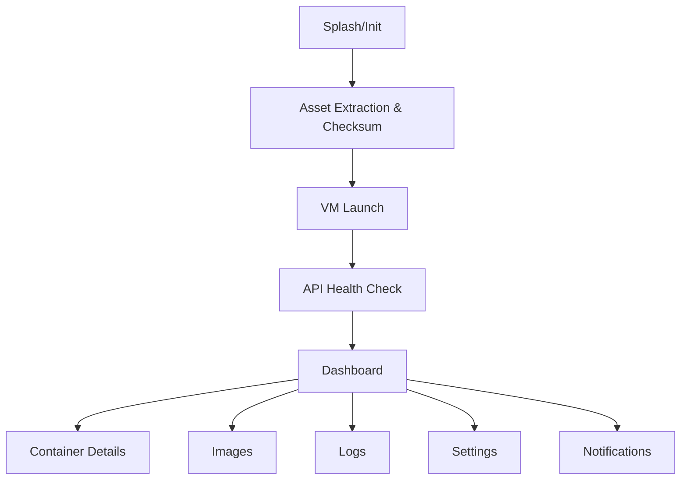

# Single-App, No-Root Architecture — Android App with Embedded Linux VM

## 1. Objective

Deliver one Android app (single APK) that runs Docker/OCI containers on non-rooted devices by embedding and launching a lightweight Linux VM in the background. No external apps (no Termux), no root, full GUI for container management.

---

## 2. No-Root Validation Summary

- Stock Android (non-rooted) typically lacks the kernel features and privileges needed for Docker/Podman:
  - cgroups configuration, namespace access, overlayfs, capabilities for a daemon
- `CONFIG_USER_NS` is absent from the Android GKI ARM64 `gki_defconfig` (defaults to `n`) and `# CONFIG_PID_NS is not set` is explicitly present; `non_debuggable.config` enforces this for production/user builds as security hardening, VTS-enforced since Android O. [Source: [gki_defconfig](https://android.googlesource.com/kernel/common/+/refs/heads/android-mainline/arch/arm64/configs/gki_defconfig); [kernel/configs README](https://android.googlesource.com/kernel/configs/+/refs/heads/master/README.md)]
- Docker rootless mode requires `CONFIG_USER_NS`, `newuidmap`/`newgidmap`, and `/etc/subuid` with ≥65,536 subordinate UIDs — unavailable on stock Android kernels. [Source: [docs.docker.com/engine/security/rootless/](https://docs.docker.com/engine/security/rootless/)]
- Rootless Podman has the same user namespace dependency.
- VM approach is validated by community implementations using QEMU + Alpine inside Android (e.g., via Termux). We integrate the same concept directly in one APK (no Termux):
  - Reference: https://github.com/mabdulmoghni/termux-docker-no-root (demonstrates Docker in a VM on Android; we embed and automate this inside the app)

Conclusion: To run Docker without root in a single app, ship a VM, install Docker inside the guest, and manage containers via a host⇄guest API.

---

## 3. High-Level Architecture

```mermaid
flowchart TD
    A[Android OS (non-rooted)]
    B[Single Android App (APK)]
    C[Embedded Linux VM (QEMU)]
    D[API Server inside VM]
    E[Container Runtime inside VM (Docker/Podman)]
    F[Logs/Images inside VM]
    G[User (GUI)]
    H[App Private Storage]

    A --> B
    B --> H
    B --> C
    C --> D
    D --> E
    E --> F
    G --> B
    B --> D
```

Key properties:
- APK contains QEMU binaries and a compressed Linux base image (QCOW2).
- First run extracts assets to app-private storage and initializes the VM.
- API server runs inside VM; app communicates via localhost TCP port-forwarding.
- Docker/Podman runs inside VM; containers/logs remain in VM filesystem.

---

## 4. Single-App Components

### 4.1 Android App (Kotlin/Java or Flutter/React Native + native modules)
- UI/UX: dashboard, containers, images, logs, settings, notifications
- Orchestration: VM lifecycle (start/stop/health), auto-restart
- Communication: HTTP client (Retrofit/OkHttp) to VM API via hostfwd (localhost)
- Assets: decompress and verify QEMU + base image; maintain checksums
- Security: token management, input validation, retention policies

### 4.2 Embedded Linux VM
- QEMU user-mode/system emulation (qemu-system-aarch64/x86_64)
- Base image: Alpine Linux (virt-optimized) QCOW2; minimal footprint
- Networking: slirp user-mode with host port forward. Constraints: "a lot of overhead so the performance is poor"; "ICMP traffic does not work"; "guest is not directly accessible from the host or external network" — only hostfwd'd ports are reachable. [Source: [wiki.qemu.org/Documentation/Networking](https://wiki.qemu.org/Documentation/Networking)]
- Bootstrap: init scripts to install Docker/Podman, start API server

### 4.3 Guest Services (inside VM)
- API Server (FastAPI/Flask/Express/Go)
- Container Runtime (Docker/Podman)
- Log storage with rotation/compression

---

## 5. Implementation Checklist (Single APK, No Root)

1. Package QEMU binaries and required shared libraries for aarch64 (and x86_64 if needed).
2. Produce a compressed base QCOW2 image (Alpine virt) with minimal packages.
3. Create bootstrap scripts to:
   - Update packages and install Docker/Podman
   - Start API server on guest port 7080
   - Configure log directories and rotation
4. Add asset integrity (SHA-256) checks and versioning.
5. Implement first-run asset extraction to app-private storage:
   - qemu/, vm/base.qcow2, vm/user.qcow2, bootstrap/
6. Create user.qcow2 (backed by base.qcow2) for writable state (8–16GB configurable).
7. Launch VM with hostfwd ports for API (7080) and optional SSH (2222).
8. Wait for API /health and then enable UI controls.
9. Implement token-based auth between app and VM API.
10. Add ForegroundService to monitor VM process and poll container status/logs.
11. Implement settings: RAM/vCPU caps, log retention, export/import.
12. Integrate notifications: status changes, errors, resource alerts.

---

## 6. VM Launch Examples (No Root)

ARM64 (aarch64) example:
```
qemu-system-aarch64 \
  -machine virt \
  -cpu cortex-a53 \
  -smp 2 \
  -m 2048 \
  -drive if=none,file=/data/data/<app>/files/vm/base.qcow2,id=base,format=qcow2,readonly=on \
  -drive if=none,file=/data/data/<app>/files/vm/user.qcow2,id=user,format=qcow2 \
  -device virtio-blk-pci,drive=user \
  -netdev user,id=net0,hostfwd=tcp::7080-:7080,hostfwd=tcp::2222-:22 \
  -device virtio-net-pci,netdev=net0 \
  -display none \
  -daemonize
```

x86_64 fallback (if needed for emulators/intel devices):
```
qemu-system-x86_64 \
  -machine q35 \
  -smp 2 \
  -m 2048 \
  -drive if=none,file=/data/data/<app>/files/vm/base.qcow2,id=base,format=qcow2,readonly=on \
  -drive if=none,file=/data/data/<app>/files/vm/user.qcow2,id=user,format=qcow2 \
  -device virtio-blk-pci,drive=user \
  -netdev user,id=net0,hostfwd=tcp::7080-:7080,hostfwd=tcp::2222-:22 \
  -device virtio-net-pci,netdev=net0 \
  -display none \
  -daemonize
```

Notes:
- slirp (user-mode) networking works without root.
- Use -daemonize; track PID and manage lifecycle in the app.

Slirp networking constraints (authoritative):
- **Performance:** "a lot of overhead so the performance is poor" vs. tap/bridge. [Source: [wiki.qemu.org/Documentation/Networking](https://wiki.qemu.org/Documentation/Networking)]
- **ICMP:** "ICMP traffic does not work (so you cannot use ping within a guest)." [Source: ibid.]
- **Isolation:** "guest is not directly accessible from the host or the external network" — inbound traffic only via hostfwd. [Source: ibid.]
- TCP and UDP forwarding via hostfwd is fully supported.

---

## 7. Guest Bootstrap (First Boot)

- On guest init:
  - apk update && apk add docker docker-cli podman (select runtime)
  - rc-update add docker default && service docker start (for Docker)
  - Install API server dependencies (pip install fastapi/uvicorn OR apt equivalents)
  - Start API on port 7080 and write token seed from mounted file
  - Create /var/lib/docker and /var/log/containers with rotation

Health endpoint:
- GET /health -> { status: "ok", runtime: "docker", version: "x.y.z" }

---

## 8. Explicit API Contract (inside VM)

- GET /health -> { status, runtime, version }
- GET /containers -> [{ name, image, status, ports }]
- POST /containers/start
  - body: { name, image, cmd, env: [{k,v}], ports: [{host,container}] }
  - res: { status: "started", name, id }
- POST /containers/stop
  - body: { name }
  - res: { status: "stopped", name }
- POST /images/pull
  - body: { image }
  - res: { status: "pulled", image }
- GET /logs
  - query: name, tail, follow
  - res: text stream or NDJSON for follow
- POST /exec
  - body: { name, cmd }
  - res: { stdout, stderr, exitCode }

Authentication:
- Header: Authorization: Bearer <token> (seeded by app at first run)

---

## 9. App ⇄ VM Communication

- Android app calls http://127.0.0.1:7080 via Retrofit/OkHttp.
- Token generated in app; written into VM via seed file (virtio-9p or initrd injection).
- Validate all inputs; sanitize commands; enforce quotas and caps.

---

## 10. Storage & Retention

- VM disks:
  - base.qcow2 (readonly)
  - user.qcow2 (mutable; define size in settings; defaults 8GB)
- Logs:
  - /var/log/containers/<name>.log rotated by logrotate (size/time policy)
  - App UI exposes export/import (scoped storage with SAF)
- Optional encryption:
  - Encrypt archives on export; consider LUKS inside VM for sensitive data

---

## 11. Security & Privacy

- VM API only accessible via localhost port-forward; guest listens on 127.0.0.1
- Token-based auth and strict input validation
- App-private storage (sandboxed) for assets and VM files
- No root; no external apps; single APK controls lifecycle
- Do not enable Docker remote TCP socket (`-H tcp://0.0.0.0:2375`); rely solely on the internal API over hostfwd
- **SELinux / App Sandbox:** Android enforces SELinux in enforcing mode. Extract assets only to app-private directories (`getFilesDir()`, `getNoBackupFilesDir()`). Ensure the target path is not mounted `noexec` before executing QEMU binaries. Test extraction and execution against production SELinux policy, not just emulators.

---

## 12. Performance Tuning

- Default vCPU=2, RAM=2GB; user-adjustable per device capability
- Prefer Alpine Linux virt; minimal services
- Use backing file layering (base + user) for upgrade-friendly images
- **KVM:** Hardware acceleration via KVM requires kernel module access (`/dev/kvm`) that is not available on stock consumer Android without root. Size performance expectations around software TCG emulation. If `/dev/kvm` is accessible on a specific device (e.g., developer boards, emulators), provide an opt-in toggle — do not assume availability. [Source: [wiki.qemu.org/License](https://wiki.qemu.org/License) — TCG BSD; KVM requires kernel module]

---

## 13. UX Flow (Single App)



---

## 14. Risks & Mitigations

- Battery/CPU usage: VM overhead; provide resource caps and background service controls
- Disk space: user.qcow2 growth; retention and cleanup tools in Settings
- Performance variability: hardware-dependent; document minimum device specs and allow user tuning
- Updates: staged Play Store rollout; telemetry (Crashlytics) for stability

### 14.1 Licensing Compliance Checklist

QEMU is GPLv2; TCG is BSD (Expat). Distributing QEMU in an APK requires:

- [ ] Include full GPLv2 license text in the app (About / Licenses screen or bundled file).
- [ ] Include TCG BSD (Expat) license text.
- [ ] Include third-party notices for QEMU dependencies (libffi, glib, pixman, etc.).
- [ ] Make QEMU source (or written offer) available per GPLv2 §3.
- [ ] Check individual file headers: `linux-user/` and `bsd-user/` are GPLv2-only (no "or later").
- [ ] Include Alpine Linux and Docker/Podman notices for packages bundled in the base image.
- [ ] Maintain a third-party-notices screen in Settings.

[Source: [wiki.qemu.org/License](https://wiki.qemu.org/License)]

### 14.2 Play Store Policy Compliance

- ForegroundService must display a persistent notification while the VM is running.
- Declare appropriate `foregroundServiceType` in `AndroidManifest.xml`; `specialUse` requires a Play Store declaration explaining the use case.
- Background execution limits (Android 8.0+): start ForegroundService via `startForegroundService()` from a foreground context.
- Disclose battery and data usage in the Play Store listing and in-app settings. [Source: [developer.android.com/develop/background-work/services/fgs](https://developer.android.com/develop/background-work/services/fgs)]

---

## 15. Testing & Rollout Plan

- Unit tests for repositories and API clients (mocked)
- Instrumentation tests for UI flows (VM mocked with fake API)
- Integration tests with real VM on ARM64 devices
- Beta channel: collect crash/usage data; adjust defaults
- Clear migration paths for image upgrades (base.qcow2 versioning)

---

## 16. Summary

This architecture provides a clear, implementation-ready plan for a single APK that runs a Linux VM in the background to host Docker/Podman on non-rooted Android. It includes VM bootstrapping, internal API design, app modules, storage/retention, security, performance tuning, UX, and rollout strategy — all without external dependencies or root.

Validated approach:
- Docker on Android without root requires a VM; this design embeds that VM and automates everything inside one app.
- Reference (community validation for VM-based Docker): https://github.com/mabdulmoghni/termux-docker-no-root

---

## 17. References

| Topic | Source |
|---|---|
| QEMU hostfwd syntax and slirp networking | https://wiki.qemu.org/Documentation/Networking |
| QEMU license (GPLv2 + TCG BSD) | https://wiki.qemu.org/License |
| Docker rootless mode prerequisites | https://docs.docker.com/engine/security/rootless/ |
| Android GKI ARM64 defconfig (CONFIG_USER_NS absent) | https://android.googlesource.com/kernel/common/+/refs/heads/android-mainline/arch/arm64/configs/gki_defconfig |
| Android kernel configs README (VTS enforcement) | https://android.googlesource.com/kernel/configs/+/refs/heads/master/README.md |
| Android ForegroundService (background work) | https://developer.android.com/develop/background-work/services/fgs |
| Community validation: Docker on Android via VM | https://github.com/mabdulmoghni/termux-docker-no-root |

_Last updated: 2026-02-24_