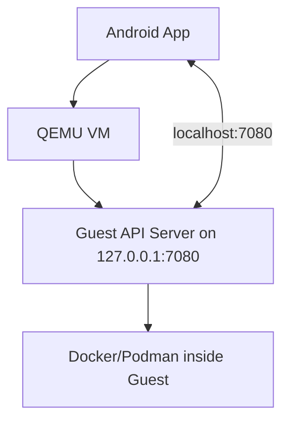

# Actionable Architecture Kickoff (ARC_START)

Goal
- Provide a concrete, step-by-step architecture plan you can start implementing immediately (first working prototype end-to-end), aligned with the validated design in [ARCHITECTURE.md](ARCHITECTURE.md:1) and [ARCHITECTURE2.md](ARCHITECTURE2.md:1), and backed by authoritative references in [CITATIONS.md](CITATIONS.md:1).

Outcome (MVP)
- One Android app (single APK) launches a QEMU VM (Alpine Linux), exposes a VM-internal API server on Android localhost via host port forwarding, and runs a simple container on command.
- Health-check endpoint responds at http://127.0.0.1:7080/health.
- Container example: run busybox echo or alpine sleep to validate orchestration.

Architecture Snapshot
- Components:
  - Android App: ForegroundService + VM manager that extracts assets, launches QEMU and polls VM API
  - QEMU System Emulation: qemu-system-aarch64 and optionally qemu-system-x86_64
  - Guest OS: Alpine Linux (QCOW2 base image + user QCOW2 writable overlay)
  - Guest API Server: Simple FastAPI or lightweight HTTP server listening on guest 127.0.0.1:7080
  - Port Forwarding: slirp user-mode networking with hostfwd exposing guest 7080 to Android localhost 7080

Mermaid Diagram


Authoritative Constraints and Syntax (quick references)
- Rootless containers on Android: Stock Android commonly disables USER_NS and related features, preventing Docker rootless prerequisites; see [CITATIONS.md](CITATIONS.md:7) and [CITATIONS.md](CITATIONS.md:53).
- Host port forwarding syntax (QEMU): see [CITATIONS.md](CITATIONS.md:25) and examples [CITATIONS.md](CITATIONS.md:29).
  - hostfwd=[tcp|udp|unix]:[[hostaddr]:hostport|hostpath]-[guestaddr]:guestport
- Slirp limitations and notes: performance overhead, ICMP/ping caveats, guest reachability; see [CITATIONS.md](CITATIONS.md:47).
- Licensing: QEMU GPLv2 and TCG BSD notes for Play distribution; see [CITATIONS.md](CITATIONS.md:37).

Deliverables (by phases)
1. Assets prepared and verifiable in app-private storage
2. Base VM boots and API server responds
3. App launches VM and calls API over localhost
4. Run one test container via API

Execution Plan (start here)

Phase 0 — Repo and Asset Prep
- Create directories under app-private (programmatic on first app run):
  - /data/data/<app>/files/qemu/
  - /data/data/<app>/files/vm/
- Bundle in APK assets:
  - qemu-system-aarch64 (primary), qemu-system-x86_64 (optional fallback)
  - qemu-img
  - base.qcow2.gz (Alpine virt)
  - bootstrap scripts (guest init + API server)

Phase 1 — Guest Image Preparation
- Base image:
  - Use an Alpine virt image (minimized) as base.qcow2 (readonly in runtime)
- User image:
  - Create user.qcow2 backed by base for writable state
  - Example (executed at first run via native wrapper):
    ```
    qemu-img create -f qcow2 /data/data/<app>/files/vm/user.qcow2 8G
    ```
- Inside guest (bootstrap script executed on first boot):
  - apk update
  - apk add docker (or podman)
  - Install a minimal API server (e.g., Python 3 + fastapi + uvicorn, or a small Go/Node/BusyBox-httpd)
  - Start API on guest 127.0.0.1:7080

Phase 2 — QEMU Launch Command
- ARM64 (primary):
  - This mirrors the example in [ARCHITECTURE.md](ARCHITECTURE.md:107) with hostfwd per [CITATIONS.md](CITATIONS.md:25):
    ```
    qemu-system-aarch64 \
      -machine virt \
      -cpu cortex-a53 \
      -smp 2 \
      -m 2048 \
      -drive if=none,file=/data/data/<app>/files/vm/base.qcow2,id=base,format=qcow2,readonly=on \
      -drive if=none,file=/data/data/<app>/files/vm/user.qcow2,id=user,format=qcow2 \
      -device virtio-blk-pci,drive=user \
      -netdev user,id=net0,hostfwd=tcp::7080-:7080 \
      -device virtio-net-pci,netdev=net0 \
      -display none \
      -daemonize
    ```
- x86_64 (optional fallback):
  - See [ARCHITECTURE2.md](ARCHITECTURE2.md:113) and reuse identical netdev/hostfwd.
- Notes:
  - Multiple hostfwd rules can be specified (e.g., add tcp::2222-:22 for SSH); see [CITATIONS.md](CITATIONS.md:29)
  - If guestaddr is omitted, default guest IP is the DHCP’s first address, see [CITATIONS.md](CITATIONS.md:26)

Phase 3 — Android App (Minimal Skeleton)
- ForegroundService:
  - Manages VM lifecycle, starts QEMU (via ProcessBuilder/JNI), monitors PID, and polls /health
- Asset Extractor:
  - On first run, checksums and extracts qemu binaries, base.qcow2.gz → base.qcow2, and writes user.qcow2
- HTTP Client:
  - Uses Retrofit/OkHttp to call http://127.0.0.1:7080 (after health OK)
- Security:
  - Generate token on first run; write seed file into guest (virtio-9p or cloud-init-like injection)
  - API enforces Authorization: Bearer <token>

Phase 4 — API Contract (Guest)
- Implement minimal endpoints (aligned with [ARCHITECTURE.md](ARCHITECTURE.md:198)):
  - GET /health → { status: "ok" }
  - POST /containers/start → run busybox/alpine with simple cmd
  - POST /containers/stop → stop by name
  - GET /containers → list currently running test containers
- Bind API only to guest loopback (127.0.0.1:7080); exposure to Android via hostfwd per [CITATIONS.md](CITATIONS.md:25)

Phase 5 — Validation and Test
- Start app; verify VM daemonizes, PID tracked
- Wait for /health OK
- Start a test container:
  - POST /containers/start { "image": "alpine:3.19", "name": "hello", "cmd": ["echo","hello"] }
- Retrieve logs or status via GET /containers
- Confirm slirp caveats:
  - Expect poor ICMP/ping; performance not equal to tap, per [CITATIONS.md](CITATIONS.md:47)

Risks and Mitigations (initial)
- Performance overhead (slirp, no KVM on most devices):
  - Keep vCPU=2, RAM=2GB defaults; document tuning in Settings
- Disk growth:
  - Default user.qcow2 = 8GB; add retention/cleanup settings
- Licensing:
  - Include GPLv2 text and third-party notices; plan compliance per [CITATIONS.md](CITATIONS.md:37)
- Policy:
  - Use ForegroundService for persistent work; add disclosures (to be collected and integrated)

Acceptance Checklist (MVP)
- [ ] Assets extracted to app-private storage with checksum verification
- [ ] QEMU VM launches headless and daemonized
- [ ] Guest API reachable at http://127.0.0.1:7080/health
- [ ] Start and stop a simple container via API
- [ ] Logs and status visible in app UI

Next Iterations (after MVP)
- Add multi-hostfwd rules (e.g., optional SSH at tcp::2222-:22)
- Implement token seeding path and virtio-9p mount
- Add export/import via SAF (images and logs)
- Gather and integrate Google Play policy citations into rollout sections in [ARCHITECTURE.md](ARCHITECTURE.md:148) and [ARCHITECTURE2.md](ARCHITECTURE2.md:213)

References
- Hostfwd syntax and examples: [CITATIONS.md](CITATIONS.md:25), [CITATIONS.md](CITATIONS.md:29)
- Slirp limitations and configuration notes: [CITATIONS.md](CITATIONS.md:47)
- Rootless/USER_NS constraints on Android: [CITATIONS.md](CITATIONS.md:7), [CITATIONS.md](CITATIONS.md:53)
- Licensing (QEMU GPLv2, TCG BSD): [CITATIONS.md](CITATIONS.md:37)