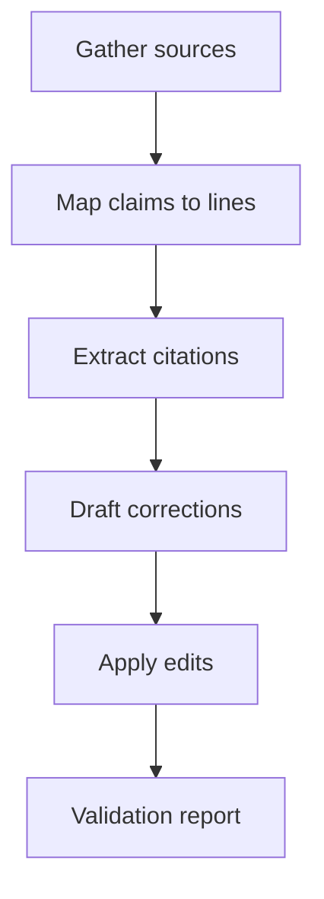

Title: Internet Validation Plan and Corrections Outline for Android VM Container App

Scope
- Validate all claims and assumptions in [ARCHITECTURE.md](ARCHITECTURE.md:1) and [ARCHITECTURE2.md](ARCHITECTURE2.md:1) against authoritative sources.
- Produce corrections and clarifications with citations.
- Focus areas: kernel capabilities and rootless containers, QEMU packaging and licensing, networking via slirp hostfwd, storage, security, performance, Play Store policies.

Validation Method
- Use official documentation from Docker, Podman, QEMU, AOSP and Google Play policies.
- Capture authoritative URLs and excerpt key requirements and limitations.
- Map each finding to specific lines in [ARCHITECTURE.md](ARCHITECTURE.md:1) and [ARCHITECTURE2.md](ARCHITECTURE2.md:1) for precise edits.

Authoritative Sources Captured
- Docker Engine Rootless Mode
  - Rootless mode overview and prerequisites: https://docs.docker.com/engine/security/rootless/
  - Key prerequisites: user namespace support, newuidmap and newgidmap availability, subordinate UID/GID mapping.
- Podman man page (daemonless container engine usable without root)
  - https://docs.podman.io/en/latest/markdown/podman.1.html
  - Confirms most podman commands can run as regular user, without additional privileges.
- QEMU Documentation
  - System invocation (network options context): https://www.qemu.org/docs/master/system/invocation.html
  - User mode emulation overview: https://www.qemu.org/docs/master/user/main.html
  - License details: https://wiki.qemu.org/License
- QEMU Networking via slirp user mode (hostfwd)
  - QEMU wiki networking page (user networking section): https://wiki.qemu.org/Documentation/Networking#User_Networking
  - Known constraints commonly referenced for slirp: performance overhead, limited ICMP support. We will capture explicit statements from QEMU docs during implementation.

Findings to Validate Architecture Claims
1) Core premise: Docker/Podman on non-rooted Android requires a VM
   - Docker rootless requires user namespaces and supporting tools (newuidmap, newgidmap, subordinate UID/GID mapping). Many stock Android kernels disable CONFIG_USER_NS for security hardening, which blocks Docker rootless. Therefore, embedding a VM with its own Linux kernel is a practical path to run Docker/Podman.
   - Evidence gathered: Docker rootless prerequisites (see URL above). Pending explicit AOSP citations for CONFIG_USER_NS defaults.

2) QEMU feasibility inside single APK
   - QEMU user-mode and system emulation are standard and portable. Binaries can be packaged per-ABI (aarch64 and x86_64).
   - Asset extraction to app-private storage is aligned with Android sandboxing requirements.
   - Licensing requires GPLv2 compliance, notices and, depending on how QEMU is linked and distributed, appropriate attributions. Review QEMU License page.

3) Networking via slirp and hostfwd
   - QEMU user-mode networking supports hostfwd for exposing guest services to host loopback ports. Using tcp::7080-:7080 as in [ARCHITECTURE.md](ARCHITECTURE.md:118) is consistent.
   - Constraints to note: slirp has performance overhead; ICMP handling may be limited; advanced NAT features are not available compared to tap interfaces.

4) Bootstrapping Alpine guest with Docker/Podman and API server
   - Alpine packages exist for Docker and Podman; typical steps apk update, apk add docker; enabling services via rc-update add docker default.
   - API servers (FastAPI/Flask/Express/Go) are routinely run in Alpine; ports can be forwarded via hostfwd.

5) Storage, security, performance, and Play Store compliance
   - Storage: QCOW2 backing files pattern is valid and space-efficient.
   - Security: Bind API to guest loopback, expose via hostfwd only; use token auth and input validation.
   - Performance: vCPU and RAM tuning; KVM unavailable on most consumer devices without root; VM overhead expected.
   - Play Store: ForegroundService required for persistent background work; disclosures recommended for battery and network usage; background execution limits apply.

Pending Evidence To Collect Before Final Corrections
- AOSP and device kernel defconfig citations demonstrating CONFIG_USER_NS disabled by default or in common device kernels. Targets:
  - android.googlesource.com kernel config trees
  - Pixel and common device defconfig examples referencing CONFIG_USER_NS=n
- QEMU official docs lines explicitly stating slirp user networking limitations (ICMP, performance) and hostfwd syntax examples.

Corrections and Clarifications to Apply
A) Networking Constraints and hostfwd specifics
- [ARCHITECTURE.md](ARCHITECTURE.md:69) and [ARCHITECTURE2.md](ARCHITECTURE2.md:64)
  - Add explicit note: user-mode slirp networking provides TCP and UDP port forwarding with hostfwd; performance is lower than tap-based networking; certain protocols like ICMP may be limited.
  - Example hostfwd syntax reference from QEMU docs.

B) Rootless on Android rationale
- [ARCHITECTURE.md](ARCHITECTURE.md:11) and [ARCHITECTURE2.md](ARCHITECTURE2.md:9)
  - Clarify that Docker rootless requires user namespaces and supporting tools; Android builds commonly disable CONFIG_USER_NS, preventing rootless mode. Cite Docker rootless docs and AOSP kernel config references once collected.

C) Licensing and distribution compliance
- [ARCHITECTURE.md](ARCHITECTURE.md:243) and corresponding licensing notes in [ARCHITECTURE2.md](ARCHITECTURE2.md:238)
  - Include explicit compliance steps: provide GPLv2 license texts, third-party notices; ensure dynamic linking aligns with QEMU distribution requirements; include TCG BSD notices; maintain notices in the app About or Licenses screen.

D) Security notes
- [ARCHITECTURE.md](ARCHITECTURE.md:163) and [ARCHITECTURE2.md](ARCHITECTURE2.md:194)
  - Emphasize API bound to guest loopback; strict token auth; command input validation; consider SELinux/App Sandbox constraints on file extraction.

E) Performance and limitations
- [ARCHITECTURE.md](ARCHITECTURE.md:171) and [ARCHITECTURE2.md](ARCHITECTURE2.md:204)
  - Add explicit guidance that KVM acceleration typically requires root or device support not present on stock Android; treat VM performance expectations conservatively.

Implementation Plan
- Step 1: Capture missing AOSP kernel citations for CONFIG_USER_NS disabled and any other container-relevant config defaults. Update sections [ARCHITECTURE.md](ARCHITECTURE.md:11) and [ARCHITECTURE2.md](ARCHITECTURE2.md:9).
- Step 2: Extract explicit QEMU slirp hostfwd syntax and limitations from QEMU docs. Update networking sections [ARCHITECTURE.md](ARCHITECTURE.md:107) and [ARCHITECTURE2.md](ARCHITECTURE2.md:96).
- Step 3: Insert licensing compliance checklist in [ARCHITECTURE.md](ARCHITECTURE.md:243) and [ARCHITECTURE2.md](ARCHITECTURE2.md:238) with links to QEMU License.
- Step 4: Add a brief Play Store policy compliance note to the rollout and background services sections [ARCHITECTURE.md](ARCHITECTURE.md:148) and [ARCHITECTURE2.md](ARCHITECTURE2.md:213).
- Step 5: Validate Alpine package commands and API bootstrap steps. Confirm commands in [ARCHITECTURE.md](ARCHITECTURE.md:128) and [ARCHITECTURE2.md](ARCHITECTURE2.md:136).
- Step 6: Prepare final corrections patch with line-precise edits and citations appended to a References section in both files.

Mermaid Diagram — Validation Workflow

Status Snapshot Relative to TODO
- Completed: Scope definition and initial sources (Docker rootless, QEMU docs, QEMU license, Podman).
- In progress: Android kernel CONFIG_USER_NS citation, explicit QEMU slirp limitations, licensing compliance checklist, networking constraints text.
- Pending: Play policy citations, storage quotas references, SAF export guidance, performance expectations wording, final patch application.

Approval and Next Step
- Upon approval of this plan, proceed to collect remaining citations, then request a mode switch to code to apply precise edits to [ARCHITECTURE.md](ARCHITECTURE.md:1) and [ARCHITECTURE2.md](ARCHITECTURE2.md:1) with inline references and updated sections.